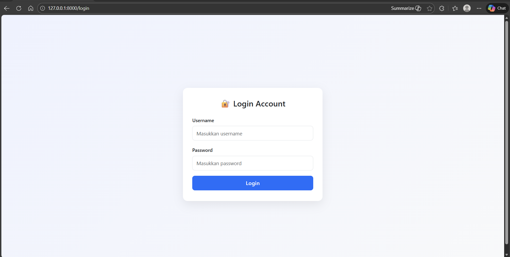
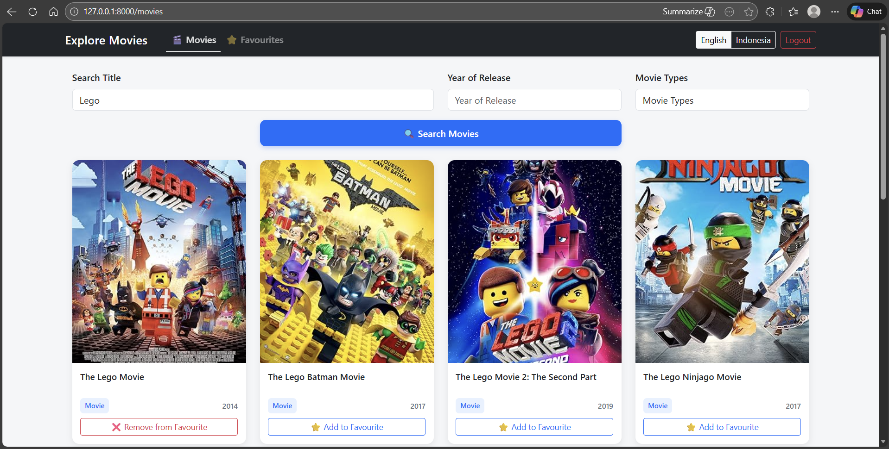
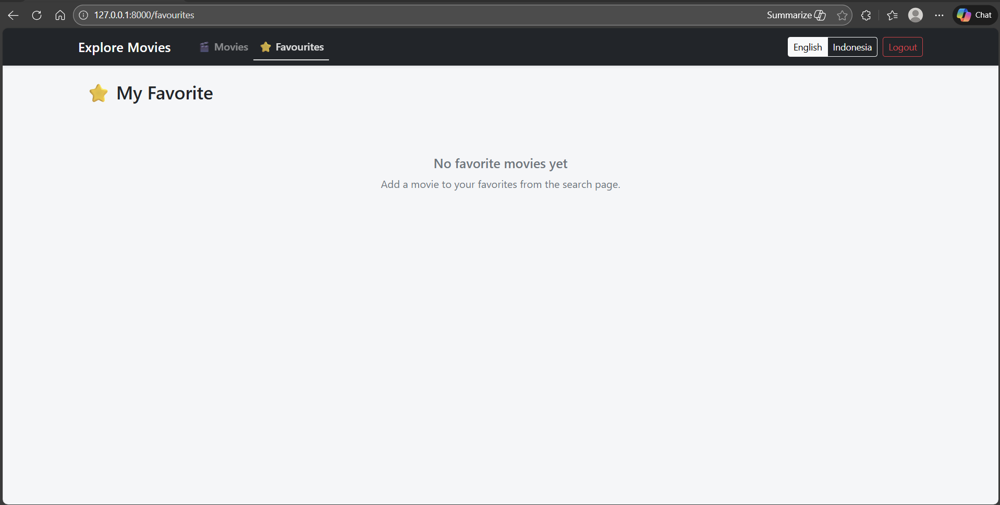

# 🎬 Explore Movies — FlowerAdvisor

Simple movie explorer web application built with Laravel that integrates with OMDb API.
Users can search movies, view details, and manage favourite lists.

---

## 🚀 Features

* 🔐 Login Authentication
* 🔍 Search Movies
* 📅 Filter by Year
* 🎞️ Filter by Movie Type
* ⭐ Add / Remove Favourites
* 📄 Movie Detail Page
* 🌐 Multi-language (EN / ID)

---

## 🧰 Libraries & Technologies

**Backend**

* Laravel Framework
* Guzzle HTTP Client
* Laravel Authentication

**Frontend**

* Bootstrap 5
* jQuery AJAX

**API**

* OMDb API (Movie Data)

---

## 🏗️ Architecture

This project uses **MVC (Model — View — Controller)**:

* **Model** → FavouriteModel
* **View** → Blade Templates
* **Controller** →

  * MovieController
  * FavouriteController
  * LoginController
  * . . . etc

Flow:
User → Controller → OMDb API → View → User

---

## 📸 Screenshots

### 🔐 Login

### 🎬 Movies

### ⭐ Favourites

### 📄 Detail Movie

---

